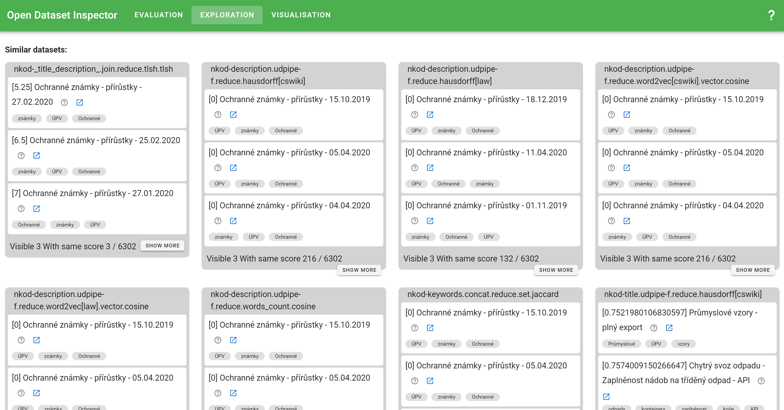
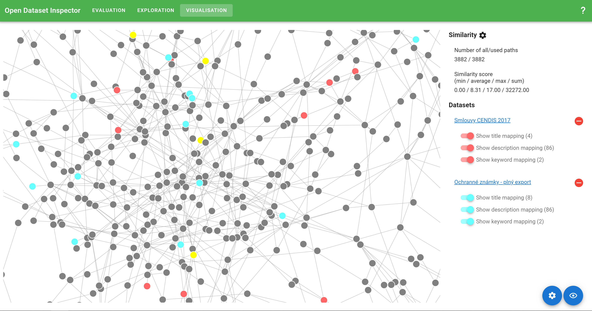

# Open Dataset Inspector (ODIN)
This is a tool used for exploration and evaluation of various search methods for finding datasets in open data portals.

## Use cases
Currently, it serves several main tasks.

### Evaluation
In this part of the tool, for a given set of input datasets, search results of various search methods are presented.
The user does not see the identification of the method producing particular results.
The results can be ordered by the user based on their perceived relevancy to the given use case.
The ordering is collected for further processing with the aim of determining the performance of individual search methods when used in various use cases and by various users.

### Exploration
In the exploration part, the user can input their datasets and see the search results, including identification of the methods giving particular results.
This use case is for exploring the search methods and the results they give, with no intent of collecting the results.

### Visualization
This part of the tool is used to explore dataset similarity based on their mapping to a subgraph of Wikidata made of *instance of* and *subclass of* predicates.
The tool offers three kinds of graph visualizations. 

#### Network dataset mapping visualization

### Search
This part of the tool is used to search similar datasets to the user query. 
